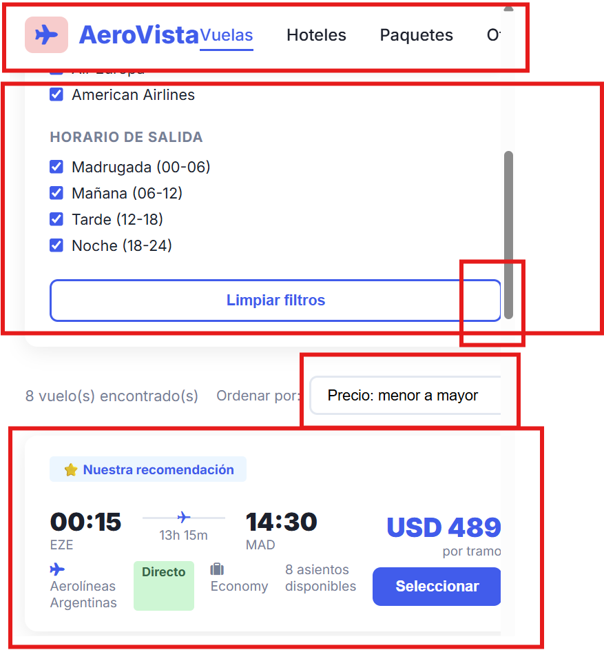
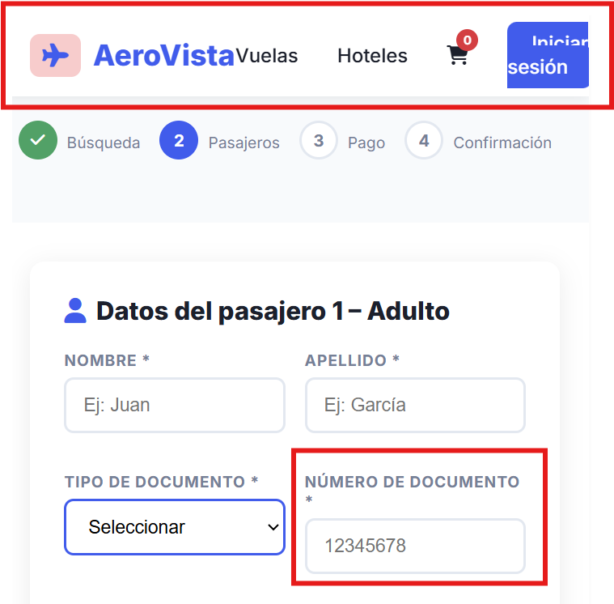
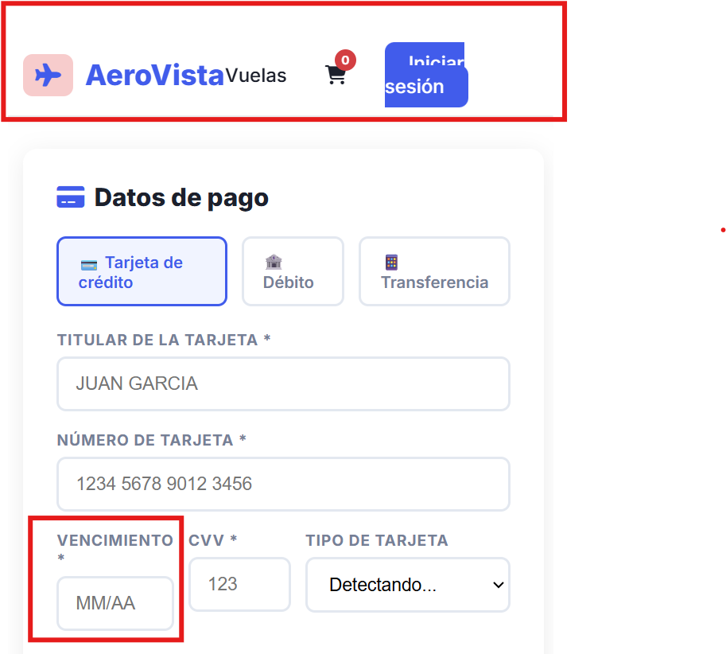

## Reportes de bugs

---

### 🆔 ID Bug
`BUG-001`

### 📄 Página / Módulo
[Toda la web en general]

### 🏷️ Tipo
- [x] Visual  
- [ ] Funcional  
- [ ] Validación  
- [ ] Lógica  
- [ ] UX  

### 🚨 Severidad
- [ ] 🔴 Crítico (bloqueante)
- [ ] 🟠 Alto
- [ ] 🟡 Medio
- [x] 🟢 Bajo

### 🧾 Título
> Al reducir el tamaño de la página, por ejemplo: versión tablet y/o mobile, se evidencias diferentes errores relacionados al responsive (o a la falta del mismo).

### ⚙️ Precondiciones
- [Estado inicial]
- [Ej: Usuario logueado / Producto creado]

### 🔁 Pasos para reproducir
1. Ir a: `[http://3.239.228.202:3000/]`
2. Recorrer las diferentes páginas (Home, Resultados de búsqueda, Detalles del vuelo, Checkout, etc) achicando el tamano de las mismas.

### ❌ Resultado actual
> Se observan campos desalineados, componentes que no están acondicionados para los distintos tamaños de pantalla, el navbar que queda por fuera sin lograrse un menú hamburguesa o similar

### ✅ Resultado esperado
> La página, y todos los componentes que la conforman, deben ajustarse correctamente a los difeerentes tamaños

### 📎 Evidencia
- 📷 Screenshots: [
                    ,
                    ,
                    ,
                    
                ]
- 🎥 Video: N/A
- 📄 Logs: N/A

-------------------------------------------------------------